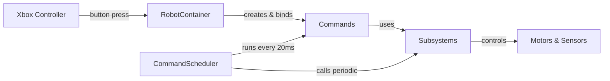
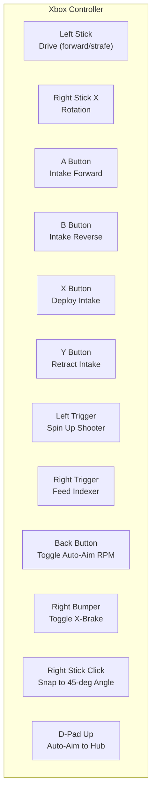
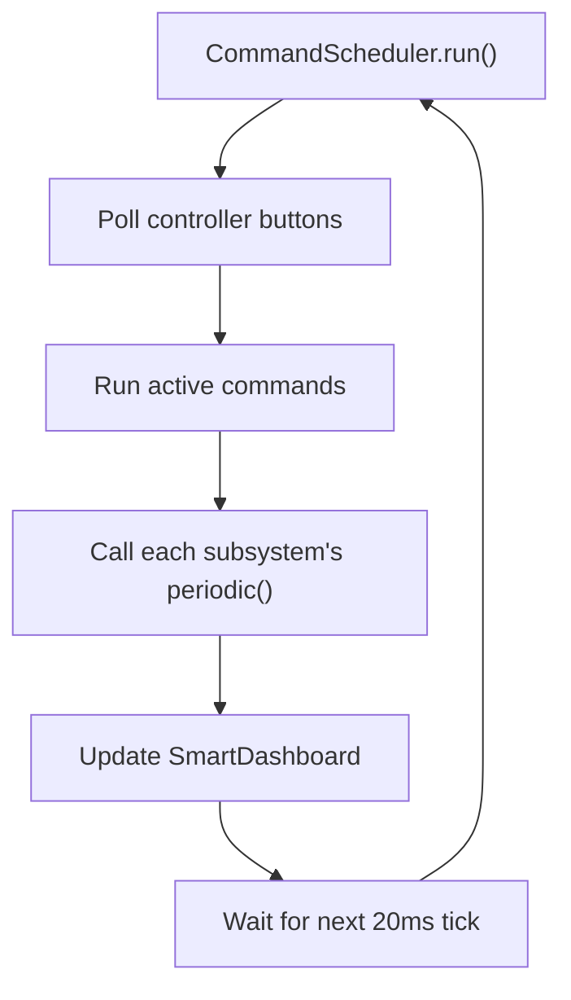

# Project Overview

This page explains how our robot code is organized and how the pieces fit together. Read this first before diving into any specific subsystem.

## The Big Picture

Our robot uses a pattern called **Command-Based Programming**. Think of it like this:

- **Subsystems** are the robot's body parts (drivetrain, intake, shooter, etc.)
- **Commands** are actions — things those body parts can do ("drive forward," "deploy intake," "spin up shooter")
- **RobotContainer** is the wiring diagram — it connects controller buttons to commands
- **CommandScheduler** is the brain — it runs every 20 milliseconds and executes whatever commands are active



## Folder Structure

Here's where everything lives in the `src/main/java/frc/robot/` folder:

```
frc/robot/
├── Robot.java              ← Entry point, starts the scheduler
├── RobotContainer.java     ← Wires subsystems + buttons + autos together
├── Constants.java          ← All CAN IDs, PID values, physical measurements
├── Main.java               ← Boots up the robot (don't touch this)
├── Telemetry.java          ← Publishes live data to dashboard
├── LEDStrip.java           ← Controls the RGB LED strip
├── LimelightHelpers.java   ← Talks to the Limelight camera (don't touch this)
├── commands/
│   └── Autos.java          ← Autonomous routines
├── generated/
│   └── TunerConstants.java ← Swerve tuning + subsystem factory methods (auto-generated)
└── subsystems/
    ├── CommandSwerveDrivetrain.java  ← Swerve drive
    ├── IntakeSubsystem.java          ← Intake arm + rollers
    ├── ShooterSubsystem.java         ← Shooter wheels + indexer
    ├── VisionSubsystem.java          ← Limelight + AprilTag tracking
    └── ClimberSubsystem.java         ← Climber (not yet implemented)
```

## Key Files Explained

### `Robot.java`
The starting point. It creates a `RobotContainer` and runs the `CommandScheduler` every 20ms. You rarely need to change this file.

```java
@Override
public void robotPeriodic() {
    CommandScheduler.getInstance().run();
}
```

### `RobotContainer.java`
**This is the file you'll edit most often.** It:
1. Creates all the subsystems
2. Binds controller buttons to commands
3. Sets up the autonomous chooser

Here's how subsystems are created:

```java
private final CommandSwerveDrivetrain drivetrain = TunerConstants.createDrivetrain();
private final IntakeSubsystem intake = TunerConstants.createIntake();
private final ShooterSubsystem shooter = TunerConstants.createShooter();
```

### `Constants.java`
Every magic number lives here — CAN IDs, PID gains, gear ratios, physical measurements. When you need to change a value, look here first.

### `TunerConstants.java` (generated)
Auto-generated by CTRE's Tuner X tool. Contains swerve module configurations and factory methods like `createDrivetrain()`. **Don't edit this by hand** — use Tuner X to regenerate it.

## How Button Bindings Work

In `RobotContainer.java`, the `configureBindings()` method connects Xbox controller inputs to commands. Here's the pattern:

```java
// When the A button is held, run the intake forward
joystick.a().whileTrue(
    Commands.run(() -> this.intake.runIntake(1.0), this.intake)
);
```

What this says: "While the A button is held down, keep running the intake at full speed. When released, stop."

### Current Controller Layout



## How Autonomous Works

We pick which autonomous routine to run from SmartDashboard before the match starts using a `SendableChooser`:

```java
autoChooser.setDefaultOption(Autos.DO_NOTHING, Autos.DO_NOTHING);
autoChooser.addOption(Autos.DRIVE_FORWARD, Autos.DRIVE_FORWARD);
SmartDashboard.putData("Auto Chooser", autoChooser);
```

Autonomous routines live in `Autos.java`. They're built by chaining commands together with `Commands.sequence()`:

```java
public Command DriveForward() {
    return Commands.sequence(
        drivetrain.runOnce(() -> drivetrain.seedFieldCentric(new Rotation2d(0.0))),
        drivetrain.applyRequest(() -> drive.withVelocityX(0.5)).withTimeout(5.0),
        drivetrain.applyRequest(SwerveRequest.Idle::new)
    );
}
```

This reads as: "Set forward direction → drive at 0.5 m/s for 5 seconds → stop."

## The 20ms Loop

The robot runs on a fixed 20ms cycle (50 times per second). Every cycle:



This means any code you write in a command's `execute()` method or a subsystem's `periodic()` method runs 50 times per second automatically.
