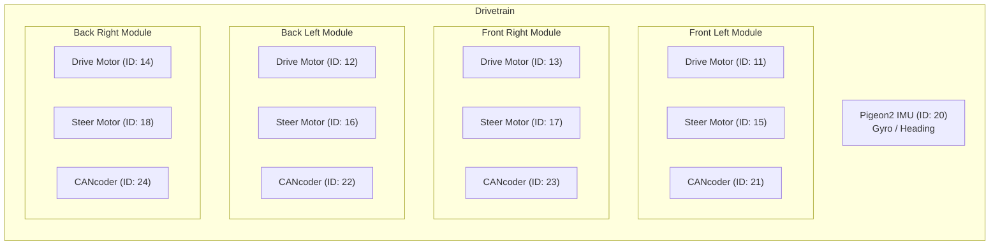
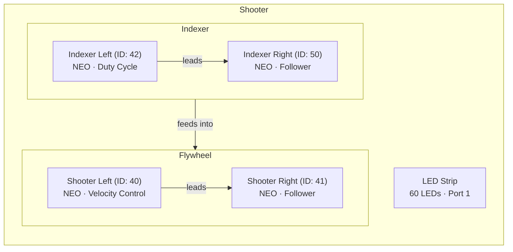
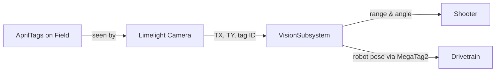

# Subsystems Guide

Each subsystem represents one physical part of the robot. This page explains what each one does, what hardware it controls, and the key methods you'd use.

> **Tip:** CAN IDs are defined in `Constants.java` under `CANConstants`. If a motor isn't responding, double-check the ID matches what's configured in Tuner X.

---

## Swerve Drivetrain

**File:** `subsystems/CommandSwerveDrivetrain.java`

The drivetrain uses **swerve drive** — each of the 4 wheel modules has its own drive motor (for speed) and steer motor (for direction). This lets the robot move in any direction while facing any direction.



### How Driving Works

The default drive command reads the Xbox controller joysticks and sends a **FieldCentric** swerve request:

```java
drivetrain.driveDefaultCommand(
    MAX_SPEED.times(MathUtil.applyDeadband(joystick.getLeftY(), 0.1)),
    MAX_SPEED.times(MathUtil.applyDeadband(joystick.getLeftX(), 0.1)),
    MAX_ANGULAR_RATE.times(MathUtil.applyDeadband(joystick.getRightX(), 0.1)),
    drive);
```

- **Left stick Y** → Forward/backward speed
- **Left stick X** → Left/right strafe speed
- **Right stick X** → Rotation speed
- **Deadband of 0.1** → Ignores tiny stick movements (prevents drift)

### Drive Modes (SwerveRequests)

| Request | What It Does | When It's Used |
|---------|-------------|----------------|
| `FieldCentric` | Normal driving — "forward" is always toward the far wall | Default teleop |
| `SwerveDriveBrake` | Locks wheels in an X pattern so the robot can't be pushed | When joystick is idle |
| `PointWheelsAt` | Points all wheels in one direction | End-of-match alignment |
| `Idle` | Motors coast, no active control | When robot is disabled |
| `FieldCentricFacingAngle` | Drives normally but auto-rotates to a target heading | Snap-to-angle feature |

### Key Specs

| Property | Value |
|----------|-------|
| Max speed | 4.58 m/s (at 12V) |
| Max rotation | 0.75 rotations/sec |
| Wheel radius | 2 inches |
| Drive gear ratio | 6.75:1 |
| Steer gear ratio | 21.4:1 |

### Key Methods

| Method | What It Does |
|--------|-------------|
| `applyRequest(supplier)` | Sends a drive command (returns a `Command` you can bind to a button) |
| `driveDefaultCommand(...)` | The main drive loop — handles joystick input and X-brake when idle |
| `seedFieldCentric(rotation)` | Resets which direction is "forward" for field-centric driving |
| `toggleAutoXBraking()` | Turns end-of-match wheel alignment on/off |
| `getPigeon2()` | Gets the gyro sensor (for reading heading, yaw, etc.) |

---

## Intake

**File:** `subsystems/IntakeSubsystem.java`

The new intake uses one full-size NEO deploy motor (REV-21-1650) on CAN 30 and one NEO Vortex roller motor with a Solo Adapter on CAN 32. The user's photos identify these motors: deploy is configured as `NEO_JST`, replacing the incorrect `NEO550_JST` setting, and rollers use `VORTEX_JST`. The old CAN 31 follower and automatic unlatching sequence have been removed. The shooter still has both indexer motors, CAN 42 and CAN 50; CAN 50 follows CAN 42 with opposed motor alignment.

### Controls and commissioning settings

| Control / setting | Behavior |
|-------------------|----------|
| A / B, held | Rollers forward / reverse at up to 6 V, half nominal 12 V |
| X / Y | Deploy / return fully up |
| D-pad right / left | In **enabled Test mode**, add / subtract one jog step per press |
| Dashboard jog steps | `Intake/Deploy Jog Step (deg)` and `Intake/Retract Jog Step (deg)`, initially 1 degree each |
| Up position | 0 degrees relative to the physical startup position |
| Deployed position | Confirmed 90 degrees from up; total gear reduction still unverified |
| Position tolerance | 1 degree |
| Motion profile | 15 degrees/s cruise, 30 degrees/s^2 acceleration, 120 degrees/s^3 jerk |
| Deploy output limits | +/-2 V, 20 A stator, 20 A supply; commissioning values requiring hardware validation |

All deploy targets are saved and clamped to the configured travel range. Subsequent holds and jogs use that saved target. Negative steps retract. The dashboard accepts degrees; Phoenix soft limits and Motion Magic profile settings are explicitly converted to mechanism rotations.

### Findings from commit c0e7583 and the existing controls

- The deploy-motor photo shows a full-size NEO (REV-21-1650). The old NEO 550 motor arrangement did not match that motor. Correct this before tuning gains: Phoenix uses the arrangement to select motor/sensor behavior, and a mismatch can prevent correct motor operation. This is a plausible contributor to the reported twitching/squealing, not proof of their sole cause. The NEO Vortex/Solo Adapter in the other photo belongs to the rollers, which the user reports were already working.
- The commit deleted `INDEXER_RIGHT_MOTOR_ID` even though `ShooterSubsystem` still referenced it. Restoring CAN 50 restores the existing shooter intake/indexer and fixes compilation. The exact committed source could not have produced a new successful build without that fix; confirm the robot is running the expected build.
- `jogPosition()` previously sent a temporary target without updating the stored target. The default command immediately commanded the old position again, which could cause a twitch or no visible motion. Left D-pad also sent a positive step.
- `Rotations.of(50)` meant 50 complete arm rotations, not 50 degrees. With the configured 12.8:1 reduction, that corresponds to 640 motor rotations. The previous 5-rotation deploy jog, 0.5-rotation retract jog, and 0.5-rotation tolerance were also much larger than this arm's travel.
- The old profile allowed 5 arm rotations/s (1,800 degrees/s), despite the small PID gains. Small gains are not a speed, voltage, or torque limit. The revised profile and independent output limits provide explicit commissioning bounds; they do not establish that the mechanism is safe or correctly tuned.
- Telemetry used to run only in the default command. It now runs in subsystem `periodic()`, including while roller commands run and while the robot is disabled.

### Before tuning on the robot

1. Physically place/support the arm fully up **before robot code starts**. Startup assigns zero to the relative encoder; there is no absolute reference or homing switch. Starting with the arm down makes all software limits wrong. Merely disabling/re-enabling does not re-zero the encoder.
2. Verify the full-size NEO deploy motor is connected to Talon FXS CAN 30, with its sensor cable connected to JST and the phase leads connected as specified by CTRE (red A, black B, white C). The Vortex/Solo Adapter roller motor is on CAN 32. Verify the deploy arm's entire reduction is really 12.8 motor turns per arm turn. The user confirmed 90 degrees of travel but has not verified the gear ratio. Include all gearbox, gear, chain, and belt stages; the motor end-cap photo does not show these. Confirm that down corresponds to increasing encoder position. At 12.8:1, 90 degrees of arm travel is 3.2 motor turns. Verify endpoint clearance from mechanical stops.
3. Confirm `Intake/Deploy Config Status` and `Intake/Deploy Zero Status` report success. Configuration errors must be resolved before motion testing.
4. Select **Test and Enable** in Driver Station. Verify `Intake/Test Enabled` is true and the Xbox controller is on USB port 0. Tap and release right D-pad: `Intake/Target Position (deg)` should increase by 1 degree per press. Left should decrease it, stopping at zero. A left jog at zero correctly does nothing. Use the new `(deg)` dashboard entries, not the old `(tr)` entries.
5. Compare target and actual angle with `Intake/Deploy Motor Voltage (V)` and `Intake/Deploy Stator Current (A)`. A target that changes and persists confirms the jog path works. A changing target with very low voltage points toward insufficient gains/feedforward. Little motion with appreciable current can indicate a stalled or binding mechanism; disable and inspect it rather than repeatedly adding target error. Unexpected angle direction or scale calls for checking inversion, gearing, and sensor feedback first.

The existing PID/feedforward gains were deliberately left unchanged. For `MotionMagicVoltage`, kP = 0.1 means 0.1 V per **rotation** of error: only about 0.00028 V for 1 degree or 0.025 V for 90 degrees, before feedforward. At the new cruise speed, kV = 0.12 contributes only 0.005 V. kS = 0.25 V and kG = 0.1 V may not overcome friction or support the loaded arm, particularly with only one motor. A small jog may consequently update the target without visibly moving the arm until tuned.

The current gravity configuration uses Phoenix's default constant elevator compensation. An arm normally needs angle-dependent gravity compensation, but enabling `Arm_Cosine` also requires a correctly referenced horizontal angle (or calibrated offset) and sign. Do not simply enable it while assuming the current up-at-zero reference is horizontal. Measure geometry, then tune gravity/static feedforward and proportional gain in controlled increments within the commissioning limits. Retune velocity feedforward in mechanism units as well. If the output reaches a configured limit, reassess the mechanism and required torque before changing that limit.

Squealing alone cannot distinguish insufficient drive, binding, motor commutation/sensor problems, or oscillation from this source code. Use the measurements above and check the motor/controller faults and wiring. Do not infer that the sound is harmless or that increasing kP will fix it.

WPILib 2026 does not enable LiveWindow by default in Test mode. This project does not enable it, and the scheduler runs in `robotPeriodic()`, so Test mode itself is not evidence of a disabled scheduler. The jog target overwrite and missing enable/controller input are more directly relevant checks.

References: [Phoenix motor arrangements](https://api.ctr-electronics.com/phoenix6/stable/java/com/ctre/phoenix6/signals/MotorArrangementValue.html), [REV Solo Adapter](https://docs.revrobotics.com/brushless/neo/vortex/solo-adapter), [Phoenix feedback ratios](https://api.ctr-electronics.com/phoenix6/stable/java/com/ctre/phoenix6/configs/ExternalFeedbackConfigs.html), [Phoenix closed-loop gains and gravity](https://pro.docs.ctr-electronics.com/en/stable/docs/api-reference/device-specific/talonfx/closed-loop-requests.html), [WPILib Test mode](https://docs.wpilib.org/en/stable/docs/software/dashboards/smartdashboard/test-mode-and-live-window/enabling-test-mode.html).

---
## Shooter

**File:** `subsystems/ShooterSubsystem.java`

The shooter has two motors that spin up to launch game pieces, and two indexer motors that feed pieces into the shooter.



### How It Works

- **Shooter motors** use **VelocityVoltage** — the motor controller maintains a target RPM using a PID loop. You say "spin at 2650 RPM" and it adjusts voltage to stay there.
- **Indexer motors** use **DutyCycleOut** — simple power percentage, no feedback loop.
- Same follower pattern as the intake — right motors mirror the left ones.

### Adjustable RPM Mode

When toggled on (Back button), the shooter uses the **Limelight camera** to calculate the perfect RPM based on distance to the hub:

```java
if (this.adjustableRPM && vision.hasValidShooterTarget()) {
    var target = this.vision.getVisionTarget();
    double computedRPM = getTargetShooterRPM(target.range());
    targetRPM = Revolutions.of(computedRPM);
}
```

When off, it uses a base speed of **2650 RPM** multiplied by the trigger axis (0.0 to 1.0).

### Key Methods

| Method | What It Does |
|--------|-------------|
| `spinUpShooter(speed)` | Spins flywheels. `speed` is 0.0–1.0 (or uses vision-computed RPM if adjustable mode is on) |
| `setIndexerSpeed(speed)` | Runs the indexer to feed game pieces. 0.0–1.0 |
| `toggleAdjustableRPM()` | Toggles between base RPM and vision-calculated RPM |
| `getTargetShooterRPM(range)` | Calculates the ideal RPM for a given distance to the hub (in inches) |
| `setVision(vision)` | Links the shooter to the vision subsystem for auto-aiming |

---

## Vision

**File:** `subsystems/VisionSubsystem.java`

The vision subsystem uses a **Limelight camera** to detect AprilTags on the field. It does two main jobs:

1. **Shooter targeting** — finds the hub's AprilTag and calculates the angle and distance for the shooter
2. **Pose estimation** — uses MegaTag2 to figure out where the robot is on the field and feeds that to the drivetrain



### How Targeting Works

Every 20ms cycle, the vision subsystem:
1. Reads raw data from the Limelight (target X angle, Y angle, area, tag ID)
2. Calculates distance to the visible tag using camera height and angle math
3. Scans all visible tags looking for the shooter target (tag 9 for red, tag 25 for blue)
4. Feeds MegaTag2 pose estimates into the drivetrain's Kalman filter for better position tracking

### Key Data

| Value | What It Is |
|-------|-----------|
| `TX` | Horizontal angle to the target (degrees, left/right of center) |
| `TY` | Vertical angle to the target (degrees, above/below center) |
| `TA` | Target area (how much of the image the tag fills — bigger = closer) |
| `range` | Calculated distance to the tag in inches |

### Key Methods

| Method | What It Does |
|--------|-------------|
| `hasValidShooterTarget()` | Returns `true` if the camera can see the hub's AprilTag |
| `getVisionTarget()` | Returns a `VisionTarget` with the angle and range to the hub |
| `getTX()` | Gets the horizontal angle to the shooter tag (for auto-aiming rotation) |
| `hasValidPoseEstimate()` | Returns `true` if MegaTag2 has a usable field position estimate |
| `setDrivetrain(drivetrain)` | Links vision to drivetrain so pose estimates feed into odometry |

---

## LEDs

**File:** `LEDStrip.java`

A simple wrapper around WPILib's `AddressableLED` for a 60-LED RGB strip on port 1.

```java
LEDPattern pattern = LEDPattern.solid(Color.kYellow);
pattern.applyTo(this.ledBuffer);
this.led.setData(this.ledBuffer);
```

### Patterns

| Code | Color | Meaning |
|------|-------|---------|
| `'Y'` | Yellow | Shooter is spinning |
| `'B'` | Blue | Shooter idle |
| `'W'` | White | (available for custom use) |
| `'O'` / anything else | Off | Default / LEDs off |
