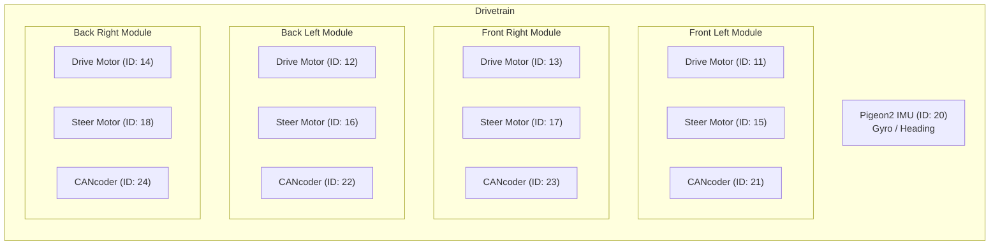
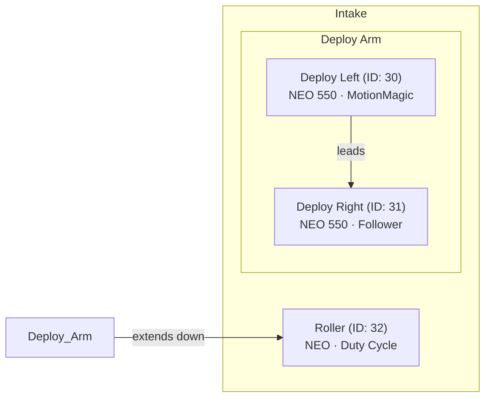
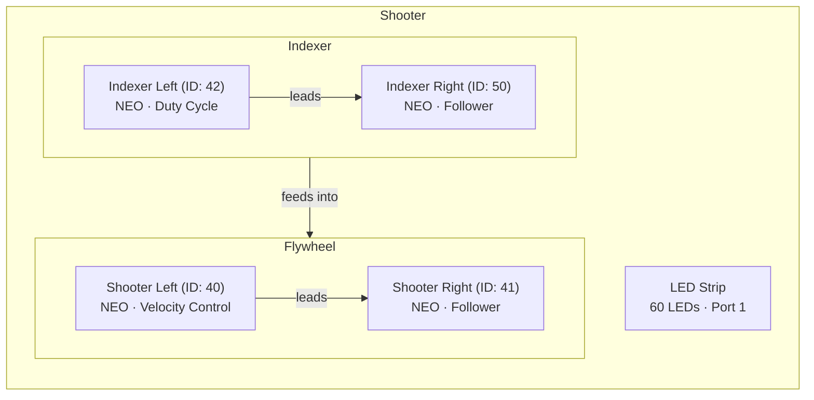
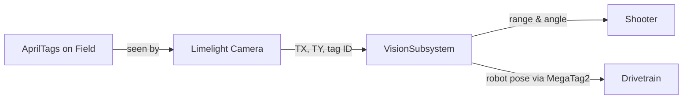

# Subsystems Guide

Each subsystem represents one physical part of the robot. This page explains what each one does, what hardware it controls, and the key methods you'd use.

> **Tip:** CAN IDs are defined in `Constants.java` under `CANConstants`. If a motor isn't responding, double-check the ID matches what's configured in Tuner X.

---

## Swerve Drivetrain

**File:** `subsystems/CommandSwerveDrivetrain.java`

The drivetrain uses **swerve drive** — each of the 4 wheel modules has its own drive motor (for speed) and steer motor (for direction). This lets the robot move in any direction while facing any direction.



### How Driving Works

The default drive command reads the Xbox controller joysticks and sends a **FieldCentric** swerve request:

```java
drivetrain.driveDefaultCommand(
    MAX_SPEED.times(MathUtil.applyDeadband(joystick.getLeftY(), 0.1)),
    MAX_SPEED.times(MathUtil.applyDeadband(joystick.getLeftX(), 0.1)),
    MAX_ANGULAR_RATE.times(MathUtil.applyDeadband(joystick.getRightX(), 0.1)),
    drive);
```

- **Left stick Y** → Forward/backward speed
- **Left stick X** → Left/right strafe speed
- **Right stick X** → Rotation speed
- **Deadband of 0.1** → Ignores tiny stick movements (prevents drift)

### Drive Modes (SwerveRequests)

| Request | What It Does | When It's Used |
|---------|-------------|----------------|
| `FieldCentric` | Normal driving — "forward" is always toward the far wall | Default teleop |
| `SwerveDriveBrake` | Locks wheels in an X pattern so the robot can't be pushed | When joystick is idle |
| `PointWheelsAt` | Points all wheels in one direction | End-of-match alignment |
| `Idle` | Motors coast, no active control | When robot is disabled |
| `FieldCentricFacingAngle` | Drives normally but auto-rotates to a target heading | Snap-to-angle feature |

### Key Specs

| Property | Value |
|----------|-------|
| Max speed | 4.58 m/s (at 12V) |
| Max rotation | 0.75 rotations/sec |
| Wheel radius | 2 inches |
| Drive gear ratio | 6.75:1 |
| Steer gear ratio | 21.4:1 |

### Key Methods

| Method | What It Does |
|--------|-------------|
| `applyRequest(supplier)` | Sends a drive command (returns a `Command` you can bind to a button) |
| `driveDefaultCommand(...)` | The main drive loop — handles joystick input and X-brake when idle |
| `seedFieldCentric(rotation)` | Resets which direction is "forward" for field-centric driving |
| `toggleAutoXBraking()` | Turns end-of-match wheel alignment on/off |
| `getPigeon2()` | Gets the gyro sensor (for reading heading, yaw, etc.) |

---

## Intake

**File:** `subsystems/IntakeSubsystem.java`

The intake has a deployable arm that extends down to collect game pieces, plus rollers that pull them in.



### How It Works

- **Deploy motors** use **MotionMagic** — this tells the motor to go to an exact position following a smooth curve instead of slamming there instantly. Think of it like cruise control for position.
- **Roller motor** uses **DutyCycleOut** — just a simple percentage of power. 1.0 = full forward, -1.0 = full reverse.
- The right deploy motor is a **follower** — it automatically copies whatever the left motor does (but inverted, since it's on the opposite side).

### Positions

| Position | Value (rotations) | Meaning |
|----------|-------------------|---------|
| Start | 0.0 | Where the arm is when the robot boots |
| Deployed | 50.0 | Arm fully down, ready to collect |
| Retracted | -5.0 | Arm pulled back past start (used to unlatch) |

### Prime Sequence

At the start of auto and teleop, the intake runs a "prime" sequence:

```java
public Command primeIntakeCommand() {
    return sequence(
        runOnce(() -> setDeployTarget(INTAKE_RETRACTED_POSITION)),
        waitUntil(this::isAtPosition).withTimeout(2),
        runOnce(() -> setDeployTarget(INTAKE_START_POSITION)),
        waitUntil(this::isAtPosition).withTimeout(2)
    );
}
```

This retracts the arm (to unlatch any mechanism), then returns to the start position.

### Key Methods

| Method | What It Does |
|--------|-------------|
| `runIntake(speed)` | Spins the rollers. `1.0` = pull in, `-1.0` = spit out, `0.0` = stop |
| `setIntakePosition(up)` | Deploys (`false`) or retracts (`true`) the arm using MotionMagic |
| `holdDeployPosition()` | Keeps the arm at its current target (called every loop to maintain position) |
| `isAtPosition()` | Returns `true` if the arm is within 0.5 rotations of its target |
| `jogPosition(steps)` | Nudges the arm by a small amount (for fine-tuning in test mode) |
| `primeIntakeCommand()` | Returns a Command that runs the retract→return-to-start sequence |

---

## Shooter

**File:** `subsystems/ShooterSubsystem.java`

The shooter has two motors that spin up to launch game pieces, and two indexer motors that feed pieces into the shooter.



### How It Works

- **Shooter motors** use **VelocityVoltage** — the motor controller maintains a target RPM using a PID loop. You say "spin at 2650 RPM" and it adjusts voltage to stay there.
- **Indexer motors** use **DutyCycleOut** — simple power percentage, no feedback loop.
- Same follower pattern as the intake — right motors mirror the left ones.

### Adjustable RPM Mode

When toggled on (Back button), the shooter uses the **Limelight camera** to calculate the perfect RPM based on distance to the hub:

```java
if (this.adjustableRPM && vision.hasValidShooterTarget()) {
    var target = this.vision.getVisionTarget();
    double computedRPM = getTargetShooterRPM(target.range());
    targetRPM = Revolutions.of(computedRPM);
}
```

When off, it uses a base speed of **2650 RPM** multiplied by the trigger axis (0.0 to 1.0).

### Key Methods

| Method | What It Does |
|--------|-------------|
| `spinUpShooter(speed)` | Spins flywheels. `speed` is 0.0–1.0 (or uses vision-computed RPM if adjustable mode is on) |
| `setIndexerSpeed(speed)` | Runs the indexer to feed game pieces. 0.0–1.0 |
| `toggleAdjustableRPM()` | Toggles between base RPM and vision-calculated RPM |
| `getTargetShooterRPM(range)` | Calculates the ideal RPM for a given distance to the hub (in inches) |
| `setVision(vision)` | Links the shooter to the vision subsystem for auto-aiming |

---

## Vision

**File:** `subsystems/VisionSubsystem.java`

The vision subsystem uses a **Limelight camera** to detect AprilTags on the field. It does two main jobs:

1. **Shooter targeting** — finds the hub's AprilTag and calculates the angle and distance for the shooter
2. **Pose estimation** — uses MegaTag2 to figure out where the robot is on the field and feeds that to the drivetrain



### How Targeting Works

Every 20ms cycle, the vision subsystem:
1. Reads raw data from the Limelight (target X angle, Y angle, area, tag ID)
2. Calculates distance to the visible tag using camera height and angle math
3. Scans all visible tags looking for the shooter target (tag 9 for red, tag 25 for blue)
4. Feeds MegaTag2 pose estimates into the drivetrain's Kalman filter for better position tracking

### Key Data

| Value | What It Is |
|-------|-----------|
| `TX` | Horizontal angle to the target (degrees, left/right of center) |
| `TY` | Vertical angle to the target (degrees, above/below center) |
| `TA` | Target area (how much of the image the tag fills — bigger = closer) |
| `range` | Calculated distance to the tag in inches |

### Key Methods

| Method | What It Does |
|--------|-------------|
| `hasValidShooterTarget()` | Returns `true` if the camera can see the hub's AprilTag |
| `getVisionTarget()` | Returns a `VisionTarget` with the angle and range to the hub |
| `getTX()` | Gets the horizontal angle to the shooter tag (for auto-aiming rotation) |
| `hasValidPoseEstimate()` | Returns `true` if MegaTag2 has a usable field position estimate |
| `setDrivetrain(drivetrain)` | Links vision to drivetrain so pose estimates feed into odometry |

---

## LEDs

**File:** `LEDStrip.java`

A simple wrapper around WPILib's `AddressableLED` for a 60-LED RGB strip on port 1.

```java
LEDPattern pattern = LEDPattern.solid(Color.kYellow);
pattern.applyTo(this.ledBuffer);
this.led.setData(this.ledBuffer);
```

### Patterns

| Code | Color | Meaning |
|------|-------|---------|
| `'Y'` | Yellow | Shooter is spinning |
| `'B'` | Blue | Shooter idle |
| `'W'` | White | (available for custom use) |
| `'O'` / anything else | Off | Default / LEDs off |
